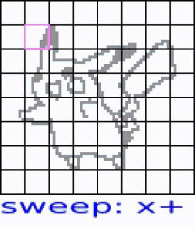

# ESDF Generation Visualized

This is a partial implementation and visualization of the ```nvblox``` ESDF generation algorithm outlined in [1].

Euclidean signed distance fields (ESDF) contain the distance from any point to the nearest surface and are, e.g., used for path planning in robotics.

[1] Millane, Alexander, et al. "nvblox: GPU-Accelerated Incremental Signed Distance Field Mapping." arXiv preprint arXiv:2311.00626 (2023).

## Preview



The *sweep and propagate* algorithm runs on the CPU and operates on a per-block basis.
