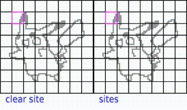

# ESDF Generation Visualized

This is a partial implementation and visualization of the ```nvblox``` ESDF generation algorithm outlined in [1].

Euclidean signed distance fields (ESDF) contain the distance from any point to the nearest surface and are, e.g., used for path planning and collision checking in robotics.

[1] Millane, Alexander, et al. "nvblox: GPU-Accelerated Incremental Signed Distance Field Mapping." arXiv preprint arXiv:2311.00626 (2023).

## Preview



The *sweep and propagate* algorithm runs on the CPU and operates on a per-block basis.
The *sweeps* in x, y, z directions are followed by a *propagation* phase, where voxels are transferred across block boundaries. 
This iterative process continues until reaching convergence.

The *sites* are block indices referring the origin, i.e., the block with closest surface to the voxel.
If the surfaces change, the *sites* are used to identify the blocks that need to be cleared and recalculated.

The original algorithm is a bit smarter than this implementation and executes those operations in parallel primarily on the GPU.